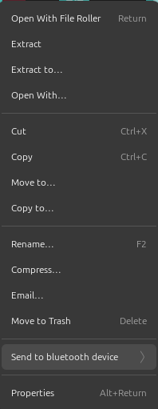
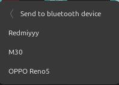

# Nautilus 46.2 Send To Bluetooth Ubunt 24.04

This extension adds a context menu item to nautilus that allows you to send files to your Bluetooth devices

Install on other distros
Make sure python3, nautilus-python, bluez

then download, extract the zip file and copy the SendToBluetooth.py file to

/usr/share/nautilus-python/extensions/

or

~/.local/share/nautilus-python/extensions/

then restart nautilus using nautilus -q command

